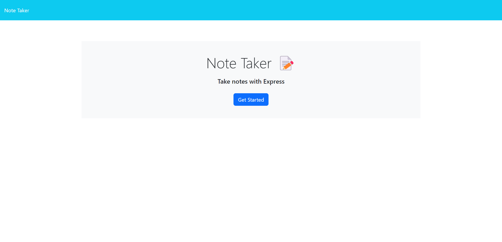
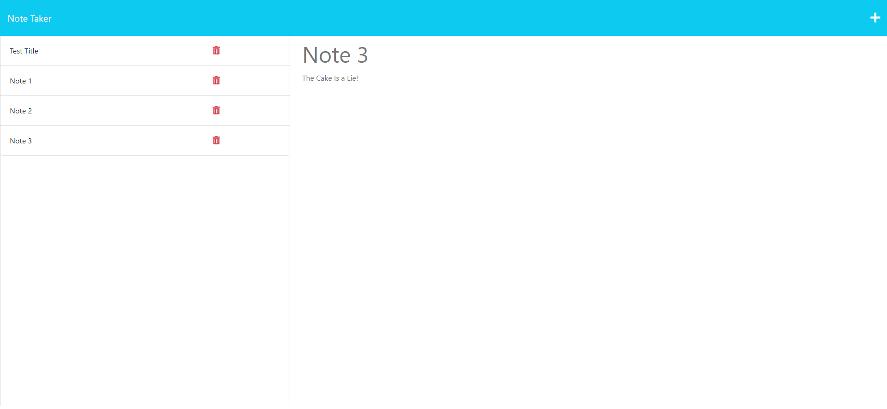

# Note Taker

    

  ## Description
  

  ## Table of Contents
  - [Description](#description)
  - [Screenshot](#screenshot)
  - [Installation](#installation)
  - [Usage](#usage)
  - [License](#license)
  - [Contribution](#contribution)
  - [Testing](#test)
  - [Questions](#questions)
  - [Contact Info](#contact-info)

  ## Screenshot
  Landing Page
  
  Notes Page
  
  
  ## Installation
  Please be sure to have node.js installed on your computer.  Clone the repo into your folder.  Make sure you have express, jest and uuid already installed as well.

  ## Usage
  Just open the application in your browser with this [link](https://mt-note-taker-7ef9bb46c97a.herokuapp.com/) Enjoy!
  
  ## License
  This project is covered under the mit [License](https://opensource.org/licenses/MIT)

  ## Contribution
  N/A

  ## Testing
  N/A

  ## Questions
  You can find the link to my application [here](https://mt-note-taker-7ef9bb46c97a.herokuapp.com/)
  
  ## Contact Info
  - Github: [https://github.com/markthos]
  - Email: aydenthos@gmail.com
